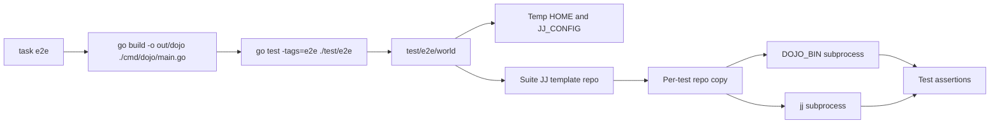

# Dojo CLI E2E Test Execution Plan

## Problem statement

`dojo-jj` needs end-to-end coverage that exercises the compiled `dojo` binary the same way a user does, while still being ordinary Go tests that can run through `go test`, IDEs, and Taskfile targets.

The repository currently has a placeholder suite under `internal/e2e`, but it is not registered with a `Test...` entry point, does not execute the compiled binary, and does not create isolated JJ repositories or workspace directories. Ordinary test runs should stay fast and should not require `DOJO_BIN`, JJ fixture setup, or user-local JJ configuration.

The implementation must create an opt-in E2E harness that:

- Executes only the compiled CLI supplied by `DOJO_BIN`.
- Uses isolated, disposable test directories.
- Uses `jj` subprocesses only, never direct `git` commands.
- Prevents user JJ config, home directory, color, or signing settings from leaking into tests.
- Leaves the production CLI and service layers as black-box subprocess behavior from the E2E package.

## Approach overview

Move the placeholder E2E suite to a top-level `test/e2e` package, guard all E2E files with the `e2e` build tag, and add a `task e2e` workflow that builds `out/dojo`, sets `DOJO_BIN`, and runs the tagged package.

Add a small `test/e2e/world` helper package that owns test roots, environment construction, subprocess execution, and JJ repository fixtures. The world resolves `DOJO_BIN`, validates that `jj` is on `PATH`, writes a test-owned JJ config, creates a reusable colocated JJ template repository during the E2E run, and copies that template into a fresh temp directory for each test.

E2E test code should assert behavior through `RunDojo` and `RunJJ` helper methods. It must not import production internals such as `internal/cmd`, `internal/factory`, `internal/service`, or `internal/dependencies`.



## Overall acceptance criteria

- `go test ./...` passes with `DOJO_BIN` unset and does not discover or execute E2E tests.
- `task test` runs `go test ./...`.
- `task e2e` builds `out/dojo`, sets `DOJO_BIN` to the built binary, and runs `go test -tags=e2e ./test/e2e`.
- `DOJO_BIN="$(pwd)/out/dojo" go test -tags=e2e ./test/e2e -run TestWorkspacePoolE2ESuite -count=1` passes on a machine with `jj` available on `PATH`.
- A tagged E2E run with missing or non-executable `DOJO_BIN` fails during setup with a message that names `DOJO_BIN` and the invalid value.
- E2E tests create all repositories, workspaces, JJ config, and home directories under `t.TempDir`-owned roots.
- E2E command environments set `JJ_CONFIG` to a test-owned config file, set `HOME` to a test-owned directory, and disable colored output with `NO_COLOR=1` and JJ config.
- E2E code does not import production internals. A reviewer can run `rg 'github.com/mcoot/dojo-jj/internal/(cmd|factory|service|dependencies)' test/e2e` and get no matches.
- At least one E2E test executes `DOJO_BIN` from inside a copied colocated JJ repository and asserts the exit code and output.
- At least one E2E test proves the JJ-not-on-path error path by running the compiled `dojo get` with an environment where `jj` cannot be found.

Manual verification:

1. Run `task test` and confirm unit tests pass without `DOJO_BIN`.
2. Run `task e2e` and confirm the E2E suite builds and executes the compiled CLI.
3. Run `DOJO_BIN="$(pwd)/out/dojo" go test -tags=e2e ./test/e2e -run TestWorkspacePoolE2ESuite/Test_DojoGet_WhenJJMissingFromPath -count=1 -v` and confirm the failure-path test reports the expected CLI error behavior.

## Design, architecture, and interfaces

### Package layout

```text
test/
  e2e/
    workspace_pool_test.go
    world/
      world.go
      command.go
      repo.go
      world_test.go
```

All Go files under `test/e2e` and `test/e2e/world` should include:

```go
//go:build e2e
```

The old `internal/e2e` files should be moved or removed so there is one E2E harness location.

### Taskfile contract

`Taskfile.yaml` should expose:

```yaml
tasks:
  test:
    cmds:
      - go test ./...

  e2e:
    deps:
      - build
    env:
      DOJO_BIN: "{{.TASKFILE_DIR}}/out/dojo"
    cmds:
      - go test -tags=e2e ./test/e2e
```

The existing `build`, `fmt`, `lint`, and `lint:fix` targets should remain.

### World helper contract

The helper API should stay small and subprocess-oriented:

```go
type World struct {
    Root         string
    HomeDir      string
    JJConfigPath string
    DojoBin      string
    JJBin        string
    TemplateRepo string
    CommandTimeout time.Duration
}

type CommandResult struct {
    Args     []string
    Dir      string
    Stdout   string
    Stderr   string
    ExitCode int
    Duration time.Duration
    Err      error
}

func New(t testing.TB) *World
func (w *World) NewRepoFromTemplate(t testing.TB, name string) string
func (w *World) RunDojo(t testing.TB, dir string, args ...string) CommandResult
func (w *World) RunJJ(t testing.TB, dir string, args ...string) CommandResult
func (r CommandResult) RequireSuccess(t testing.TB)
func (r CommandResult) RequireFailure(t testing.TB)
```

Implementation details can split this across files, but callers should not need lower-level `exec.Command` setup.

### Subprocess rules

- Resolve `DOJO_BIN` once per `World` with `filepath.Abs` when it is relative.
- Validate `DOJO_BIN` exists, is not a directory, and has at least one executable bit set.
- Resolve `jj` with `exec.LookPath("jj")`; fail setup clearly if it is missing for normal E2E runs.
- Run subprocesses with `exec.CommandContext` and a default timeout, initially 10 seconds.
- Set `cmd.Dir` to the active copied repository or workspace directory.
- Capture stdout and stderr separately.
- Return a stable exit code for both success and failure. For signal or context timeout failures, use a sentinel exit code such as `-1` and preserve the error.
- Include command arguments and working directory in failure messages.

### Environment rules

The world should build command environments from `os.Environ()` plus deterministic overrides:

```text
DOJO_BIN=<absolute compiled binary>
HOME=<world temp home>
JJ_CONFIG=<world temp jj-config/config.toml>
NO_COLOR=1
PATH=<controlled path>
```

For normal tests, keep a `PATH` that can find `jj`. For the JJ-missing test, override `PATH` to a temp directory with no `jj` while invoking `DOJO_BIN` by absolute path.

The JJ config should be written as TOML:

```toml
user.name = "Dojo E2E"
user.email = "dojo-e2e@example.invalid"
ui.color = "never"
git.colocate = true

[signing]
behavior = "drop"
backend = "none"
```

### Repository fixture rules

The initial implementation should generate the template repository during E2E setup rather than committing nested `.jj` or `.git` directories into the source tree.

Template creation:

1. Create `<suite-temp>/template-repo`.
2. Run `jj git init <template-repo>` through `RunJJ` or a lower-level setup helper using the same isolated environment.
3. Write a small tracked fixture file such as `README.md`.
4. Run `jj describe -m "template root"` from the template repo.
5. Treat the template as read-only after setup.

Per-test repository creation:

1. Copy the template directory to `<test-temp>/repos/<name>`.
2. Preserve file modes and directory structure, including `.jj` and `.git`.
3. Perform test-specific file writes, workspace adds, command execution, and assertions only inside the copied repo or derived workspaces.

## Milestones

### Milestone 1: E2E package and task wiring

#### Milestone description

Move the placeholder E2E harness to its final top-level package, make it opt-in with build tags, register the suite, and add the Taskfile entry points that define the developer workflow.

#### Verifiable milestone acceptance criteria

- `internal/e2e` no longer contains the active E2E harness.
- `test/e2e/workspace_pool_test.go` exists, has the `e2e` build tag, and defines `func TestWorkspacePoolE2ESuite(t *testing.T)`.
- `go test ./...` passes with `DOJO_BIN` unset.
- `task test` runs `go test ./...`.
- `task e2e` depends on `build`, sets `DOJO_BIN` to `{{.TASKFILE_DIR}}/out/dojo`, and runs `go test -tags=e2e ./test/e2e`.

#### Task checklist

- Move `internal/e2e/workspace_pool_test.go` to `test/e2e/workspace_pool_test.go`.
- Move `internal/e2e/world/world.go` to `test/e2e/world/world.go`.
- Update package imports from `github.com/mcoot/dojo-jj/internal/e2e/world` to `github.com/mcoot/dojo-jj/test/e2e/world`.
- Add `//go:build e2e` to all E2E files.
- Add `TestWorkspacePoolE2ESuite`.
- Keep the placeholder lifecycle test temporarily until real CLI tests replace it.
- Add `test` and `e2e` targets to `Taskfile.yaml`.

#### Test plan for TDD

- Red: Run `go test -tags=e2e ./test/e2e -run TestWorkspacePoolE2ESuite -count=1` before the move and observe the package does not exist.
- Green: After the move and registration, the tagged package is discoverable.
- Regression: Run `go test ./...` with `DOJO_BIN` unset and confirm no E2E setup runs.
- Taskfile check: Run `task --list` or `task e2e --dry` if available and confirm `e2e` is wired to `build` and tagged Go tests.

#### Implementation notes or gotchas

- Do not add production imports to the E2E package to make assertions easier.
- If helper files are non-test `.go` files, build-tag them too so ordinary package discovery stays clean.
- Do not use direct `git` commands in setup or tests.

### Milestone 2: Binary, environment, and command execution helpers

#### Milestone description

Build the `world` helper around explicit binary resolution, deterministic environment construction, subprocess execution, result capture, and clear setup errors.

#### Verifiable milestone acceptance criteria

- `world.New(t)` fails fast when `DOJO_BIN` is empty, missing, a directory, or non-executable.
- `world.New(t)` records an absolute `DojoBin` path when `DOJO_BIN` is relative.
- `world.New(t)` creates temp `Root`, `HomeDir`, and `JJConfigPath` locations.
- `RunDojo` and `RunJJ` run with the requested working directory and isolated environment.
- `CommandResult` captures stdout, stderr, exit code, duration, args, dir, and error.
- Failed subprocess assertions include args, dir, stdout, and stderr in the test failure output.

#### Task checklist

- Implement `World`, `CommandResult`, and constructor validation.
- Add a single environment builder with deterministic overrides.
- Add `RunDojo` and `RunJJ`.
- Add success and failure assertion helpers.
- Add timeout handling with `exec.CommandContext`.
- Add helper tests for DOJO_BIN validation and command result capture using temp fake executables or Go test helper processes.

#### Test plan for TDD

- `TestNew_WhenDojoBinMissing_ThenFailsWithHelpfulMessage`: unset `DOJO_BIN`; assert setup reports `DOJO_BIN`.
- `TestNew_WhenDojoBinNotExecutable_ThenFailsWithHelpfulMessage`: point to a temp file without executable bits.
- `TestNew_WhenDojoBinRelative_ThenStoresAbsolutePath`: run from a temp working directory with a fake executable.
- `TestRunCommand_WhenCommandSucceeds_ThenCapturesStdoutAndExitCode`: fake executable writes stdout and exits 0.
- `TestRunCommand_WhenCommandFails_ThenCapturesStderrAndExitCode`: fake executable writes stderr and exits non-zero.
- `TestEnvironment_ThenUsesTempHomeJJConfigAndNoColor`: inspect the built environment for `HOME`, `JJ_CONFIG`, and `NO_COLOR`.

#### Implementation notes or gotchas

- Avoid testing helper behavior by invoking production Go packages. Use fake executables or helper processes.
- Keep PATH override support explicit so the JJ-missing E2E test can hide `jj` without changing global process state.
- Preserve the parent environment unless a variable needs deterministic override.

### Milestone 3: JJ config isolation and copied template repositories

#### Milestone description

Add JJ fixture lifecycle support: write deterministic JJ config, generate one colocated template repository during E2E setup, and copy that template to a fresh per-test repository root.

#### Verifiable milestone acceptance criteria

- The generated JJ config exists under the world temp root and contains stable user, color, colocation, and signing settings.
- Template creation uses `jj git init`, not `git`.
- A copied repository contains `.jj` and `.git` directories and can run `jj status` successfully.
- Mutating a copied repository does not modify the template repository.
- Two copied repositories from the same template can be mutated independently.
- All generated repository paths live under `t.TempDir` roots.

#### Task checklist

- Add JJ config writer.
- Add template repository creation helper.
- Add recursive copy helper that preserves modes and handles directories/files needed by `.jj` and `.git`.
- Add `NewRepoFromTemplate(t, name)` to the world API.
- Add tests that create two copies and mutate one without affecting the other.
- Update suite setup so the template is created once and treated as read-only.

#### Test plan for TDD

- `TestWriteJJConfig_ThenContainsDeterministicSettings`: read the config file and assert required keys.
- `TestTemplateRepo_WhenCreated_ThenJJStatusSucceeds`: create template and run `jj status`.
- `TestNewRepoFromTemplate_ThenCopyHasJJAndGitMetadata`: assert `.jj` and `.git` paths exist in the copy.
- `TestNewRepoFromTemplate_WhenCopyMutates_ThenTemplateUnchanged`: write a file in the copy and assert it is absent from the template.
- `TestNewRepoFromTemplate_WhenTwoCopiesMutate_ThenCopiesAreIndependent`: mutate both copies differently and assert their filesystem state differs as expected.

#### Implementation notes or gotchas

- Do not commit generated `.jj` or `.git` directories.
- Keep template setup sequential at first. Do not add `t.Parallel()` until template copying has been audited under concurrency.
- If `JJ_CONFIG=<file>` behaves differently on another JJ version, stop and confirm the supported override form before adding compatibility code.

### Milestone 4: Black-box CLI E2E coverage

#### Milestone description

Replace the placeholder lifecycle assertion with E2E tests that run the compiled `dojo` binary from copied JJ repositories and assert observable CLI behavior.

#### Verifiable milestone acceptance criteria

- `TestWorkspacePoolE2ESuite/Test_DojoHelp_FromCopiedRepo` runs `DOJO_BIN --help` from a copied repo and asserts exit code 0 plus expected help text.
- `TestWorkspacePoolE2ESuite/Test_DojoGet_WhenJJOnPath` runs `DOJO_BIN get` from a copied repo with normal E2E environment and asserts exit code 0.
- `TestWorkspacePoolE2ESuite/Test_DojoGet_WhenJJMissingFromPath` runs `DOJO_BIN get` with `PATH` pointing at an empty temp directory and asserts non-zero exit plus stderr containing `JJ not found on path`.
- `DOJO_BIN="$(pwd)/out/dojo" go test -tags=e2e ./test/e2e -run TestWorkspacePoolE2ESuite -count=1` passes after `task build`.
- `rg 'github.com/mcoot/dojo-jj/internal/(cmd|factory|service|dependencies)' test/e2e` returns no matches.

#### Task checklist

- Replace `Test_WorkspaceLifecycle` placeholder with specific black-box CLI tests.
- Add suite setup to create the shared template repository.
- Add per-test setup to create a fresh copied repo.
- Add assertion helpers for common stdout, stderr, and exit code checks.
- Add a PATH override helper for the JJ-missing test.
- Update any developer-facing docs if the Taskfile target is not self-explanatory.

#### Test plan for TDD

- Red: Add `Test_DojoHelp_FromCopiedRepo` before `RunDojo` is implemented; observe missing helper failure.
- Green: Use `RunDojo` to assert help output.
- Red: Add `Test_DojoGet_WhenJJOnPath` before template repository copying is wired into the suite; observe missing repo setup.
- Green: Create copied repo per test and assert `dojo get` succeeds.
- Red: Add `Test_DojoGet_WhenJJMissingFromPath` with empty PATH; observe it fails until environment override support is implemented.
- Green: Assert non-zero exit and `JJ not found on path` in stderr.
- Regression: Run the full E2E command with `-count=1` to prevent cache hiding fixture issues.

#### Implementation notes or gotchas

- `cmd/dojo/main.go` currently uses `log.Fatal`, so failure stderr may include a timestamp prefix. Assert substrings, not exact stderr.
- `dojo get` currently succeeds when `jj` is available and performs no workspace mutation. Keep the first E2E assertion scoped to that current behavior.
- Future workspace lifecycle E2Es can extend this suite once production workspace creation behavior exists.

## Invariants and things that should not change

- The E2E harness must remain opt-in through `-tags=e2e`; ordinary `go test ./...` must not require `DOJO_BIN`, `jj`, or fixture setup.
- E2E tests must execute `DOJO_BIN` as a subprocess and must not instantiate production CLI, factory, service, or dependency types.
- E2E setup and assertions must use `jj` subprocesses only; do not invoke `git` directly.
- All mutable test state must live under `t.TempDir` roots.
- User-level JJ config and home directory state must not influence E2E behavior.
- Existing `Taskfile.yaml` targets `build`, `fmt`, `lint`, and `lint:fix` must keep their current behavior.
- No new third-party Go dependency is required for the initial harness.
- The initial harness should not change production CLI behavior except as forced by bugs revealed during E2E implementation and approved separately.

## Stop-and-ask boundaries

Pause implementation and ask for direction if any of these occur:

- Implementing the planned E2E tests requires changing production CLI behavior beyond the current `dojo get` success/error paths.
- `JJ_CONFIG=<file>` is not portable enough for supported JJ versions and the harness needs a different config isolation strategy.
- The generated template repository approach is rejected and nested `.jj` or `.git` fixtures would need to be committed.
- The E2E suite needs a new external dependency, service, daemon, credential, or network access.
- The implementation would auto-build the CLI inside Go tests instead of requiring `DOJO_BIN`.
- Reliable command assertions require exact timestamped `log.Fatal` output rather than substring matching or later production logging changes.
